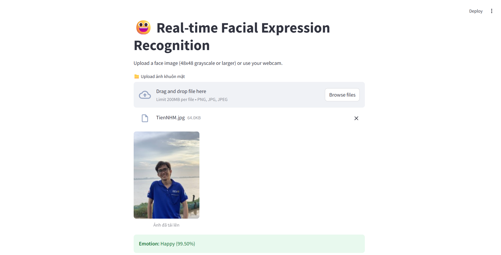

# Facial Expression Recognition

## Installation

```bash
pip install -r requirements.txt
```

## Prepare Dataset

Note: The dataset should be organized in the following structure:

```
images/
    ├── angry/
    │   ├── image1.jpg
    │   ├── image2.jpg
    │   └── ...
    ├── disgust/
    │   ├── image1.jpg
    │   ├── image2.jpg
    │   └── ...
    ├── fear/
    │   ├── image1.jpg
    │   ├── image2.jpg
    │   └── ...
    └── ...
```

## Training

```bash
python train.py
```

After training, the model will be saved in the [`models`](models/) directory.

## Demo

```bash
streamlit run demo.py
```

